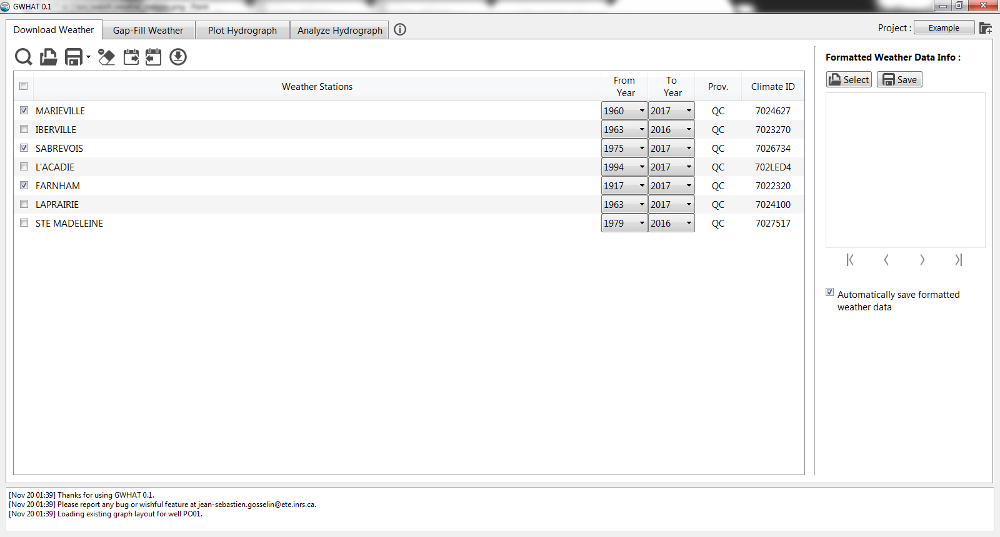
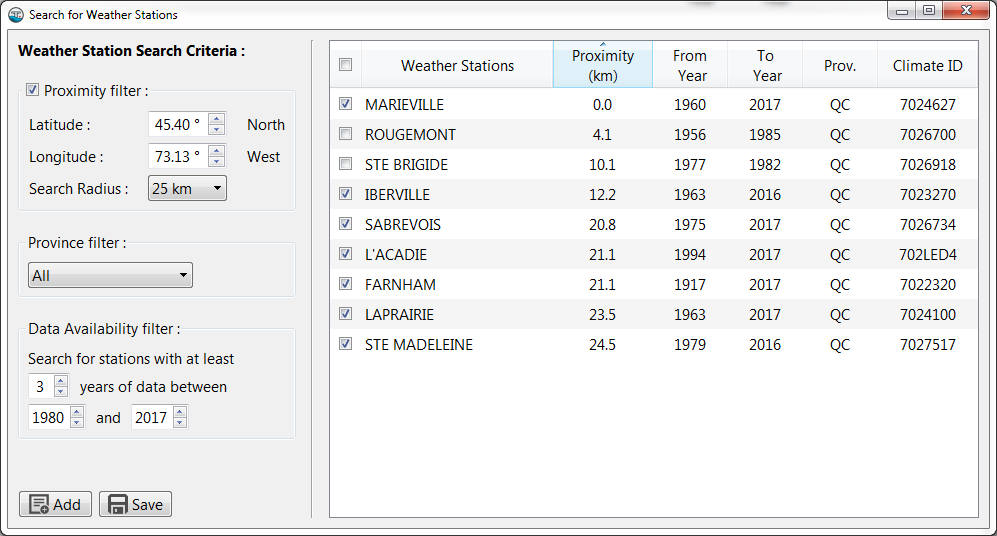

Downloading Daily Weather Data
==============================

GWHAT provides a graphical interface to the online CDCD_ (Canadian Daily Climate Database), which
contains daily data for air temperature and precipitation dating back to 1840 to the present for about
8450 stations distributed across Canada.

The interface allows to search for stations interactively using location coordinates, download the available data for the selected weather stations, and automatically organize the data in a format compatible with GWHAT. These features are available in the Download Data tab shown in Fig. 3.1. This tab consists of a toolbar located at the top of the interface, an area where are displayed the current list of weather stations for which data can be downloaded, and a side-panel to the right where can be manage the formatting of the weather data files that were downloaded for each year individually.

.. _CDCD: www.climate.weather.gc.ca

Searching for weather stations
-----------------------------------------------

It is possible to search for weather stations in the online CDCD by clicking on the magnifying glass icon in the toolbar. This will open a new dialog window (see Fig. 3.2) where it is possible to search for weather stations located within a given radius around a set of location coordinates (latitude and longitude) in decimal degrees. It is possible to further narrow down the search by including only stations with data available within a given period and/or with data available for a minimum number of years.

Downloading the weather data
-----------------------------------------------

Format of the concatenated weather datafiles
----------------------------------------------------------
